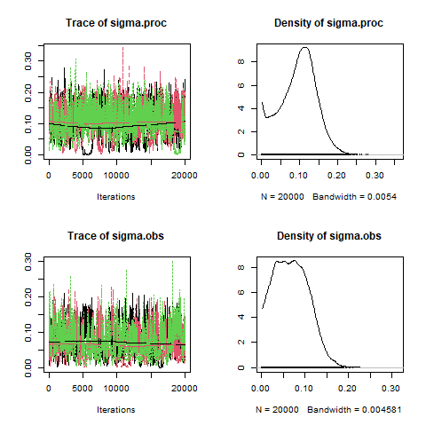
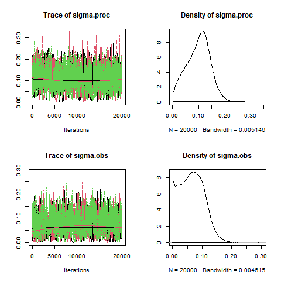
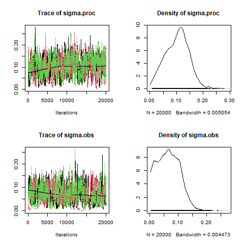
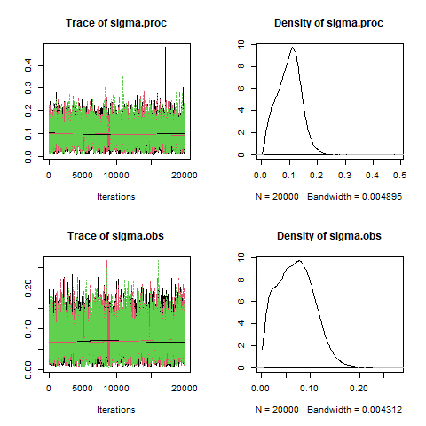
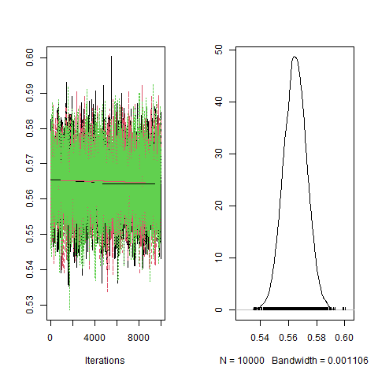
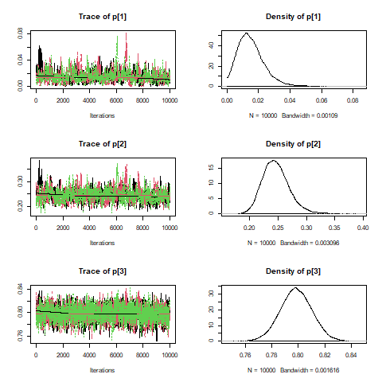
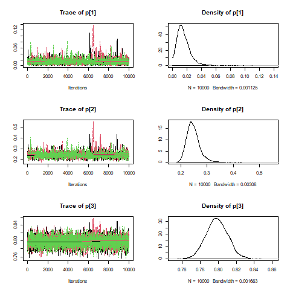

<style>
slides > slide {
  overflow-x: auto !important;
  overflow-y: auto !important;
}
</style>

```{r setup, include=FALSE}
library(nimble)
library(compareMCMCs)
library(nimbleEcology)
has_rjags <- require(rjags)
if(!has_rjags)
  warning("This Rmd file uses package rjags.  Sections using it will be skipped.")
recalculate <- FALSE
makeplot <- !recalculate
```

Overview
=====

Some strategies for improving MCMC

 - Customize sampler choices. E.g.,
    - Try sampling standard deviations on a log scale
    - Try slice samplers instead of Metropolis-Hastings [already seen].
    - Try blocking correlated parameters
    - Try multiple samplers for slow-mixing parameters [not shown].
 - Reparameterize
    - Center covariates [already seen]
    - Centered versus non-centered random effects parameterization
    - Rotated coordinates to reduce posterior correlation [already seen; more here]
 - Rewrite the model. E.g.,
    - Rewrite the model to reduce dependencies [already seen]
    - Vectorize declarations to improve computational efficiency [already seen] 
    - Marginalize to remove parameters [already seen] 
 - (Advanced) Write new samplers that take advantage of particular model structures

Sampler choices 
=====

Sampler choices:

- Sampling standard deviations on the  log scale can help, especially when there is posterior support near 0.
- Slice sampling can help mix a parameter at some computational cost.
- Hamiltonian Monte Carlo (HMC) can help mix blocks of parameters (often all parameters at once) but at heavy computational cost.
- Blocking can help when parameters are correlated *given other parameters*.
    - If parameters are *marginally correlated* but *conditionally independent*, blocking will not help.
    - This occurs if parameters are marginally correlated only because they both depend on something else.
- Model-specific understanding can yield good sampling strategies.

Centering covariates or random effects
=====

Centering refers to two issues:

- Centering of covariates as they are provided for the analysis.
    - Think of $y_i = \beta_0 + \beta_1 x_i + \epsilon_i$. 
    - If the $x_i$ are not centered, then considering $\beta_1 \rightarrow \beta_1'$ is also like adding $(\beta_1' - \beta_1) \bar{x}$ to the intercept.
    - A standard result in linear regression is that estimates of $\beta_0$ and $\beta_1$ are correlated.
    - Centering $x_i$ around its mean removes the posterior correlation between $\beta_0$ and $\beta_1$.

- Random effects with a mean of zero (non-centered parameterization) versus centered around a mean (centered parameterization).
    - E.g., `random_effect ~ N(0, sd)` vs. `random_effect ~ N(mean, sd)`.
    - Theory shows either parameterization can be better, depending on the model and data, but with reasonable amount of data, centered is often better.
    - However, for HMC, uncentered is generally better!

Back to the Martins
=====

```{r}
martin_code <- nimbleCode({
  # Priors and constraints
  logN.est[1] ~ dnorm(5.6, 0.01)       # Prior for initial population size
  mean.r ~ dnorm(1, 0.001)             # Prior for mean growth rate
  sigma.proc ~ dunif(0, 1)          # Prior for sd of state process
  sigma2.proc <- pow(sigma.proc, 2)
  tau.proc <- pow(sigma.proc, -2)
  sigma.obs ~ dunif(0, 1)           # Prior for sd of observation process
  sigma2.obs <- pow(sigma.obs, 2)
  tau.obs <- pow(sigma.obs, -2)
  
  # Likelihood
  # State process
  for (t in 1:(T-1)) {
    logN.est[t+1] ~ dnorm(logN.est[t] + mean.r, tau.proc)
  }
  
  # Observation process
  for (t in 1:T) {
    y[t] ~ dnorm(logN.est[t], tau.obs)
  }
  
  # Population sizes on real scale
  for (t in 1:T) {
    N.est[t] <- exp(logN.est[t])
  }
})

# Code from BPA book:
pyears <- 6 # Number of future years with predictions
hm <- c(271, 261, 309, 318, 231, 216, 208, 226, 195, 226, 233, 209, 
        226, 192, 191, 225, 245, 205, 191, 174, rep(NA, pyears))
year <- 1990:(2009 + pyears)

# Bundle data
martin_data <- list(y = log(hm), T = length(year))
## NIMBLE will handle y as data, T as a constant

# Initial values
martin_inits <- function(){
  list(sigma.proc = runif(1, 0, 1), mean.r = rnorm(1),
       sigma.obs = runif(1, 0, 1), 
       logN.est = c(rnorm(1, 5.6, 0.1), 
                    rep(NA, (length(year)-1))))
}

martin_model <- nimbleModel(martin_code,
                                constants = martin_data,
                                inits = martin_inits(), buildDerivs = TRUE)
mcmcConf <- configureMCMC(martin_model)
mcmcConf$printSamplers()
```

Modifying an MCMC configuration in `nimble`
=====

Let's replace the default RW (adaptive random-walk Metropolis-Hastings) samplers to sample on the log scale to not get stuck at small values.

```{r, eval = recalculate}
pars <- c("sigma.proc", "sigma.obs")
mcmcConf$removeSamplers(pars)
pars <- martin_model$expandNodeNames(pars)
for(p in pars)
  mcmcConf$addSampler(target = p,
                      type = "RW", log=TRUE)
mcmcConf$printSamplers(pars)
mcmc <- buildMCMC(mcmcConf)
compiled <- compileNimble(martin_model, mcmc)
mcmc.out.log <- runMCMC(compiled$mcmc, niter = 30000, 
                          nchains = 3, nburnin = 10000, samplesAsCodaMCMC = TRUE)

plot(mcmc.out.log[, c('sigma.proc', 'sigma.obs')])
```

```{r, eval = recalculate, include = FALSE}
png("martin_results_with_slides/mcmc_output_log.png")
plot(mcmc.out.log[, c('sigma.proc', 'sigma.obs')])
dev.off()
```


```{r, echo = FALSE, out.width="80%"}
if(makeplot) 
  
```

Modifying an MCMC configuration in `nimble`
=====

Let's replace the default RW (adaptive random-walk Metropolis-Hastings) samplers with slice samplers in the martins example.

```{r, eval = recalculate}
pars <- c("sigma.proc", "sigma.obs")
mcmcConf$removeSamplers(pars)
pars <- martin_model$expandNodeNames(pars)
for(p in pars)
  mcmcConf$addSampler(target = p,
                      type = "slice") # automatically looks for nimbleFunction named "slice" or "sampler_slice"
mcmcConf$printSamplers(pars)
mcmc <- buildMCMC(mcmcConf)
compiled <- compileNimble(martin_model, mcmc)
mcmc.out.slice <- runMCMC(compiled$mcmc, niter = 30000, 
                          nchains = 3, nburnin = 10000, samplesAsCodaMCMC = TRUE)
plot(mcmc.out.slice[, c('sigma.proc', 'sigma.obs')])
```


```{r, eval = recalculate, include = FALSE}
png("martin_results_with_slides/mcmc_output_slice.png")
plot(mcmc.out.slice[, c('sigma.proc', 'sigma.obs')])
dev.off()
```

```{r, echo = FALSE, out.width="80%"}
if(makeplot) 
  
```


Modifying an MCMC configuration in `nimble`
=====

Let's replace the default RW (adaptive random-walk Metropolis-Hastings) samplers with a block sampler on the log scale.

```{r, eval = recalculate}
pars <- c("sigma.proc", "sigma.obs")
mcmcConf$removeSamplers(pars)
pars <- martin_model$expandNodeNames(pars)
mcmcConf$addSampler(target = pars,
                      type = "RW_block", log = TRUE) # automatically looks for nimbleFunction named "slice" or "sampler_slice"
mcmcConf$printSamplers(pars)
mcmc <- buildMCMC(mcmcConf)
compiled <- compileNimble(martin_model, mcmc)
mcmc.out.block <- runMCMC(compiled$mcmc, niter = 30000, 
                          nchains = 3, nburnin = 10000, samplesAsCodaMCMC = TRUE)
plot(mcmc.out.block[, c('sigma.proc', 'sigma.obs')])
```


```{r, eval = recalculate, include = FALSE}
png("martin_results_with_slides/mcmc_output_block.png")
plot(mcmc.out.block[, c('sigma.proc', 'sigma.obs')])
dev.off()
```

```{r, echo = FALSE, out.width="80%"}
if(makeplot) 
  
```


Hamiltonian Monte Carlo
=====

Let's consider Hamiltonian Monte Carlo (HMC). This will use automatic differentiation to sample the parameters.
```{r, hmc, eval = recalculate}
library(nimbleHMC)
cmodel <- compileNimble(martin_model)
hmc <- buildHMC(martin_model)
cHMC <- compileNimble(hmc, project = martin_model)
mcmc.out.hmc <- runMCMC(cHMC, niter = 30000, 
                          nchains = 3, nburnin = 10000, samplesAsCodaMCMC = TRUE)
plot(mcmc.out.hmc[, c('sigma.proc', 'sigma.obs')])
```

```{r, eval = recalculate, include = FALSE}
png("martin_results_with_slides/mcmc_output_hmc.png")
plot(mcmc.out.hmc[, c('sigma.proc', 'sigma.obs')])
dev.off()
```


```{r, echo = FALSE, out.width="80%"}
if(makeplot) 
  
```


Marginalization
=====

In a hierarchical model, one can *in principle* always integrate over latent states. However only under certain situations can one do those integrals in closed form (analytically).

Analytic integration is always possible in conjugate situations. For example:

$$ y_i \sim N(\mu_i, \sigma^2); i=1,\ldots,n $$
$$ \mu_i \sim N(\mu_0, \sigma_0^2),  i=1,\ldots,n $$

Here there is one latent state per observation. We can do MCMC here, but it involves a large number of parameters, n+3.

If we marginalize:

  - We reduce the total number of computations done at each step of the MCMC.
  - We reduce the dimensionality of the parameter space needing exploration.
  - In some cases the complexity of calculating the marginalized density offsets some of the benefits above.

Here's the marginalized result, with only 3 parameters.

$$ y_i \sim N(\mu_0, \sigma^2 + \sigma_0^2) $$

Mixture Models
=====

Occupancy mixture model example from [Turek, Wehrhahn and Gimenez (2021). Bayesian non-parametric detection heterogeneity in ecological models.](https://link.springer.com/article/10.1007/s10651-021-00489-1)


```{r}
set.seed(123)
## number of sites
N <- 1000
## number of observation periods
T <- 6
## probability of occupancy
pOcc <- 0.7
## detection probability
pVec <- rep(c(0.2, 0.8), each=N/2)

## simulate z (occupied status),
## and y (encounter histories)
set.seed(0)
z <- rep(NA, N)
y <- matrix(NA, nrow=N, ncol=T)
for(i in 1:N) {
    z[i] <- rbinom(1, size=1, prob=pOcc)
    y[i, 1:T] <- rbinom(T, size=1, prob=z[i]*pVec[i])
}
```

```{r, eval = recalculate}
code <- nimbleCode({
    pOcc ~ dunif(0, 1)
    p ~ dunif(0, 1)
    for(i in 1:N) {
        y[i,1:T] ~ dOcc_s(pOcc, p, len=T)
    }
})
constants <- list(N=N, T=T)
data <- list(y=y)
inits <- list(pOcc=0.5, p=0.5)

Rmodel <- nimbleModel(code, constants, data, inits)
conf <- configureMCMC(Rmodel)
Rmcmc <- buildMCMC(conf)
Cmodel <- compileNimble(Rmodel)
Cmcmc <- compileNimble(Rmcmc, project=Rmodel)
samples <- runMCMC(Cmcmc, niter=15000, nchains=3, 
                  nburnin = 5000, samplesAsCodaMCMC = TRUE)
plot(samples[, 'p'])
```
```{r, eval = recalculate, include = FALSE}
png("martin_results_with_slides/mcmc_output_occ_basic.png")
plot(samples[, 'p'])
dev.off()
```


```{r, echo = FALSE, out.width="80%"}
if(makeplot) 
  
```


Mixture Models
=====

Now let's make three different detectability probabilities that we then assign to each survey with probability `pi`.

```{r, eval = recalculate}
## 3-Group Finite Mixture Occupancy Model
code <- nimbleCode({
    pOcc ~ dunif(0, 1)
    for(k in 1:K)   p[k] ~ dunif(0, 1)
    one[1] ~ dconstraint(p[1] <= p[2])  ## Identifiability
    one[2] ~ dconstraint(p[2] <= p[3])
    for(i in 1:N) {
        g[i] ~ dcat(pi[1:K])
        y[i,1:T] ~ dOcc_s(pOcc, p[g[i]], len=T)
    }
})
K <- 3    ## fixed number of groups
constants <- list(N=N, T=T, K=K)
data <- list(y=y, one=rep(1,K-1))
inits <- list(pOcc=0.5, pi=rep(1/K,K), p=rep(0.5,K), g=rep(1,N))
Rmodel <- nimbleModel(code, constants, data, inits)
conf <- configureMCMC(Rmodel, monitors = c("pi", "pOcc", "p"))
Rmcmc <- buildMCMC(conf)
Cmodel <- compileNimble(Rmodel)
Cmcmc <- compileNimble(Rmcmc, project=Rmodel)
samples.mix <- runMCMC(Cmcmc, niter=15000, nchains=3, 
                       nburnin = 5000, samplesAsCodaMCMC = TRUE)
plot(samples.mix[, c('p[1]', 'p[2]', 'p[3]')])
```
```{r, eval = recalculate, include = FALSE}
png("martin_results_with_slides/mcmc_output_occ_mix.png")
plot(samples.mix[, c('p[1]', 'p[2]', 'p[3]')])
dev.off()
```

```{r, echo = FALSE, out.width="80%"}
if(makeplot) 
```


Marginalization of the Mixture Model
=====

We can always integrate over finite discrete random variables by summation, so we can integrate over the `g[i]` variables, which take values of 1,2 or 3.

```{r}
doccmix <- nimbleFunction(
  run = function(x = double(1), pOcc = double(0), 
                 pDet = double(1), wgt = double(1),
                 len = double(),
                 log = logical(0, default = 0)) {
    
    returnType(double(0))
    # generally we want to calculate probability (density) on a 
    # log scale, but here that won't work.
    dens <- 0
    for( i in seq_along(pDet)){
      dens <- dens + wgt[i]*dOcc_s(x, pOcc, pDet[i], len=len, log = FALSE)
    }
    if(log) 
      return(log(dens)) else return(dens)
  })
```

```{r, include=FALSE}
# only needed for Rmd compilation; not needed for regular usage.
assign('doccmix', doccmix, .GlobalEnv)
# 'r' simulation function not required but included here because of Rmd compilation issues.
roccmix <- nimbleFunction(
  run = function(n = integer(0), pOcc = double(0), 
                 pDet = double(1), wgt = double(1), len = double()) {
  # warning: dummy code    
  returnType(double(1))
  return(numeric(1))
})

assign('roccmix', roccmix, .GlobalEnv)
```

Using the new distribution
====

One can then immediately use the distribution in a model. NIMBLE will compile the user-defined distribution together with everything else, as if `doccmix` were a distribution that NIMBLE provides.

```{r, eval = recalculate}
## 3-Group Finite Mixture Occupancy Model - marginalized
code <- nimbleCode({
    pOcc ~ dunif(0, 1)
    for(k in 1:K)   p[k] ~ dunif(0, 1)
    one[1] ~ dconstraint(p[1] <= p[2])  ## Identifiability
    one[2] ~ dconstraint(p[2] <= p[3])
    for(i in 1:N) {
        y[i,1:T] ~ doccmix(pOcc = pOcc, pDet = p[1:K], wgt = pi[1:K], len=T)
    }
})
K <- 3    ## fixed number of groups
constants <- list(N=N, T=T, K=K)
data <- list(y=y, one=rep(1,K-1))
inits <- list(pOcc=0.5, pi=rep(1/K,K), p=rep(0.5,K), g=rep(1,N))
Rmodel <- nimbleModel(code, constants, data, inits)
conf <- configureMCMC(Rmodel, monitors = c("pi", "pOcc", "p"))
Rmcmc <- buildMCMC(conf)
Cmodel <- compileNimble(Rmodel)
Cmcmc <- compileNimble(Rmcmc, project=Rmodel)
samples.marg <- runMCMC(Cmcmc, niter=15000, nchains=3, 
                       nburnin = 5000, samplesAsCodaMCMC = TRUE)
plot(samples.marg[, c('p[1]', 'p[2]', 'p[3]')])
```

```{r, eval = recalculate, include = FALSE}
png("martin_results_with_slides/mcmc_output_occ_marg.png")
plot(samples.marg[, c('p[1]', 'p[2]', 'p[3]')])
dev.off()
```

```{r, echo = FALSE, out.width="80%"}
if(makeplot) 
```


Writing your own sampler (Bonus if time allows)
=====

Consider a very basic linear regression of cars data in R, where distance depends on speed.

```{r, eval = FALSE}
## Understanding MCMC with Nimble:
code <- nimbleCode({
  ## Choose priors:
  b0 ~ dflat() # dunif(-Inf, Inf) flat prior for intercept.
  b1 ~ dnorm(0, tau = 0.1)  # vague prior for slope.
  sigma ~ dunif(0, 100) # flat prior for residual standard error. dhalfflat() also works.
  
  for( i in 1:n ) {
    mu[i] <- b0 + b1*speed[i]
    dist[i] ~ dnorm(mu[i], sd = sigma)
  }
})

inits <- list(b0 = 0, b1 = 3, sigma = 3)
constants <- list(n = nrow(cars), speed = cars$speed)

model <- nimbleModel(code = code, 
                     data = list(dist = cars$dist), 
                     constants = list(n = nrow(cars), speed = cars$speed),                      inits = list(b0 = rnorm(1), b1 = rnorm(1), sigma = rgamma(1,1)))

cmodel  <- compileNimble(model)
## Build the MCMC
mcmc    <- buildMCMC(model, monitors = c("b0",  "b1", "sigma")) ## Track key parameters
## Compile the MCMC samplers into C++
cmcmc   <- compileNimble(mcmc, project = model)

## Now run some iterations of the MCMC
cmcmc$run(1000)
samples <- as.matrix(cmcmc$mvSamples)
out <- as.mcmc(samples)

plot(out[,'b0'])
```

Now let's write our own Metropolis Hastings sampler to provide to our MCMC.

```{r, eval = FALSE}
My_RW_sampler <- nimbleFunction(
    contains = sampler_BASE,
    setup = function(model, mvSaved, target, control) {
        scale <- control$scale
        calcNodes <- model$getDependencies(target)
    },
    run = function() {
        currentValue <- model[[target]]
        currentLogProb <- model$getLogProb(calcNodes)
        
        proposedValue <- currentValue + rnorm(1, 0, sd = scale)
        model[[target]] <<- proposedValue
        proposalLogProb <- model$calculate(calcNodes)
        
        log_accept_prob <- proposalLogProb - currentLogProb
        
        ## Equivalent to: accept <- runif(1) < exp(log_accept_prob)
        accept <- decide(log_accept_prob) 
        
        if(accept) {
            ## return new model (saved when running "calculate")
            copy(from = model, to = mvSaved, row = 1, nodes = calcNodes, logProb = TRUE)
        } else {
            ## return original model (saved before updating)
            copy(from = mvSaved, to = model, row = 1, nodes = calcNodes, logProb = TRUE)
        }    
    },
    ## Ignore this for now.
    methods = list(reset = function() {
    })    
)

## Let's add it to the MCMC
mcmcConf <- configureMCMC(model)
mcmcConf$removeSamplers('b0')
mcmcConf$addSampler(target = 'b0', type = 'My_RW_sampler', control = list(scale = 1.2))
mcmcConf$printSamplers('b0')
mcmc <- buildMCMC(mcmcConf, monitors = c("b0",  "b1", "sigma")) ## Track key parameters
cmcmc   <- compileNimble(mcmc, project = model, resetFunctions = TRUE)

## Now run some iterations of the MCMC
cmcmc$run(1000)
samples <- as.matrix(cmcmc$mvSamples)
out <- as.mcmc(samples)
plot(out[,'b0'])
```

Basic model checking with `DHARMa` and Nimble (Bonus 2 if time allows)
====

We can build a posterior predictive nimbleFunction to interact with our model which can be used to interact with `DHARMa` for simulated residual checks. Simply need

- `Simulated response vectors` which are posterior predictive draws of a Bayesian model,
- `Observed data` in this case `y`
- `The predicted response from the model` in this case probability of occupancy x probability of observation.

```{r, eval = FALSE}
ppSamplerNF <- nimbleFunction(
          setup = function(model, mcmc) {
              dataNodes <- model$getNodeNames(dataOnly = TRUE)
              parentNodes <- model$getParents(dataNodes, stochOnly = TRUE)
              cat("Stochastic parents of data are:", paste(parentNodes, collapse = ','), ".\n")
              simNodes <- model$getDependencies(parentNodes, self = FALSE)
              vars <- mcmc$mvSamples$getVarNames()  # need ordering of variables in mvSamples / samples matrix
              cat("Using posterior samples of:", paste(vars, collapse = ','), ".\n")
              n <- length(model$expandNodeNames(dataNodes, returnScalarComponents = TRUE))
          },
          run = function(samples = double(2)) {
              nSamp <- dim(samples)[1]
              ppSamples <- matrix(nrow = nSamp, ncol = n)
              for(i in 1:nSamp) {
                    values(model, vars) <<- samples[i, ]
                    model$simulate(simNodes, includeData = TRUE)
                    ppSamples[i, ] <- values(model, dataNodes)
              }
              returnType(double(2))
              return(ppSamples)
          })
```

- Let's use the basic cars example again.

```{r, eval = FALSE}
## Understanding MCMC with Nimble:
code <- nimbleCode({
  ## Choose priors:
  b0 ~ dflat() # dunif(-Inf, Inf) flat prior for intercept.
  b1 ~ dnorm(0, tau = 0.1)  # vague prior for slope.
  sigma ~ dunif(0, 100) # flat prior for residual standard error. dhalfflat() also works.
  
  for( i in 1:n ) {
    mu[i] <- b0 + b1*speed[i]
    dist[i] ~ dnorm(mu[i], sd = sigma)
  }
})

inits <- list(b0 = 0, b1 = 3, sigma = 3)
constants <- list(n = nrow(cars), speed = cars$speed)

model <- nimbleModel(code = code, 
                     data = list(dist = cars$dist), 
                     constants = list(n = nrow(cars), speed = cars$speed),                      inits = list(b0 = rnorm(1), b1 = rnorm(1), sigma = rgamma(1,1)))

cmodel  <- compileNimble(model)
## Build the MCMC
mcmc    <- buildMCMC(model, monitors = c("b0",  "b1", "sigma")) ## Track key parameters
## Compile the MCMC samplers into C++
cmcmc   <- compileNimble(mcmc, project = model)

## Now run some iterations of the MCMC
cmcmc$run(10000)
samples <- as.matrix(cmcmc$mvSamples)
out <- as.mcmc(samples)[-(1:5000),] # Burn-in

ppsampler <- ppSamplerNF(model, mcmc) 
cppsampler <- compileNimble(ppsampler)            
predictions <- cppsampler$run(samples = out)

## Get mean response:
values(cmodel, c("b0", "b1", "sigma")) <- c(-16.195, 3.843, 15.920)
cmodel$calculate()
fitted <- values(cmodel, "mu")

library(DHARMa)
resids <- createDHARMa(simulatedResponse = t(predictions), 
                           observedResponse = cars$dist,
                           fittedPredictedResponse = fitted,
                           integerResponse = FALSE)
plot(resids)

## Compare with lm:
fit.lm <- lm(dist ~ speed, data = cars)
resids.fit <- simulateResiduals(fittedModel = fit.lm, plot = TRUE)

```